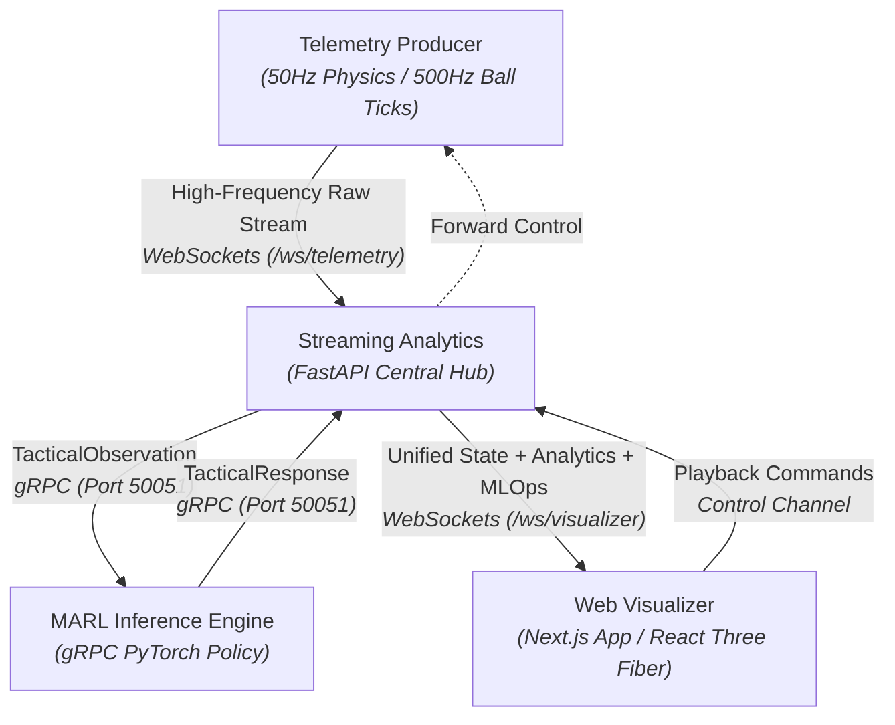

# 🌌 AuraPitch 2026
### *Distributed Multi-Agent Tactical Synthesizer & 3D Digital Twin*

[](LICENSE)
[](https://nextjs.org/)
[](https://fastapi.tiangolo.com/)
[](https://threejs.org/)
[](https://grpc.io/)

AuraPitch 2026 is a production-grade, highly performant real-time sports analytics platform and 3D digital twin simulator built for the FIFA World Cup 2026. The platform simulates high-frequency match telemetry, statefully aggregates player kinetics and passing lane options over sliding time windows, queries multi-agent reinforcement learning (MARL) tactical suggestions, and visualizes the live streams on an interactive 3D WebGL pitch along with enterprise-grade system observability.

---

## 🏗️ System Architecture

AuraPitch 2026 utilizes a decoupled microservice topology to achieve low-latency spatial rendering and stateful computations:



---

## 🗂️ Repository Structure

```
Aura-Pitch-2026/
├── apps/
│   ├── telemetry-producer/      # 50Hz Player & 500Hz Ball Physics Simulator
│   │   ├── src/producer.py      # Telemetry client & joint gait generator
│   │   └── Dockerfile
│   ├── streaming-analytics/     # FastAPI Stream Processing & Aggregator
│   │   ├── src/main.py          # WebSocket router, REST API, fallback loop
│   │   ├── src/stream_analytics.py # Convex hull, kinematics, passing lanes
│   │   ├── src/observability.py # E2E latency percentiles, data drift score
│   │   └── Dockerfile
│   ├── marl-inference-engine/   # PyTorch & gRPC Tactical Predictor
│   │   ├── models/              # PyTorch model checkpoint (.pt)
│   │   ├── src/server.py        # gRPC MARL server
│   │   └── Dockerfile
│   └── web-visualizer/          # Next.js & React Three Fiber Dashboard
│       ├── src/app/             # Pages, layouts, and global styles
│       ├── src/components/      # 3D canvas, controls, data panels
│       └── Dockerfile
├── infra/                       # Infrastructure Orchestration
│   └── docker-compose.yml       # Local multi-service environment config
├── libs/                        # Shared Protocols & Schemas
│   └── proto/
│       └── tactical_stream.proto # Centralized Protobuf definitions
├── Makefile                     # Local shortcut scripting utility
└── README.md                    # System documentation
```

---

## 🔬 Subsystems & Technical Implementation

### A. High-Frequency Telemetry Ingestion (The Data Plane)
*Located in: `apps/telemetry-producer/`*
- **Centroid Kinematics**: Generates continuous coordinate paths for 22 players (11 per team) using Ornstein-Uhlenbeck (OU) mean-reverting drift equations mapping base formations (Home: 4-3-3, Away: 4-4-2).
- **29-Point Joint Mapping**: Generates a spatial skeleton rig (head, chest, shoulders, elbows, wrists, hips, knees, ankles, feet) relative to the player's center. Limb joint offsets are dynamically updated using sinusoidal gait patterns scaled by velocity.
- **500Hz Ball Simulation**: Tracks ball coords, velocity vectors, and angular spin velocities (rad/s) at 500Hz. The producer packages 10 sub-ticks of ball data inside each 50Hz (20ms) player frame to preserve high-fidelity trajectory data.

### B. Stateful Stream Analytics (The Processing Engine)
*Located in: `apps/streaming-analytics/`*
- **Team Compactness**: Computes the area (m²) occupied by outfield players using a monotone-chain **Graham Scan** convex hull algorithm followed by a **Shoelace formula** area calculation:
  $$\text{Area} = \frac{1}{2} \left| \sum_{i=1}^{n-1} (x_i y_{i+1} - x_{i+1} y_i) + (x_n y_1 - x_1 y_n) \right|$$
- **Passing Lane Obstruction**: Projects line-of-sight rays from the ball carrier to all teammates. Checks segment intersection against the defensive radius (2.0m) of all opposing team nodes using point-to-segment distance formulas:
  $$\text{dist}(P, AB) = \left\| P - \text{proj}_{AB}(P) \right\|$$
- **Kinematic Aggregates**: Transforms coordinate differentials into velocity vectors, heading degrees, acceleration rates, and cumulative sprint distances.

### C. MARL Inference Core (The Intelligence Engine)
*Located in: `apps/marl-inference-engine/`*
- **Protobuf API**: Standardizes gRPC schemas to communicate tactical observations.
- **PyTorch Model**: Employs a feedforward neural network (`Linear -> ReLU -> Linear`) saved as a binary checkpoint (`marl_policy.pt`). The model evaluates 10 features (player kinetics + neighbor structures) and outputs 8 logits:
  - 5 logits for Suggested Action (PASS, RUN, TACKLE, SHOT, IDLE)
  - 1 logit for model prediction confidence (applied with a sigmoid function)
  - 2 logits for target landing position offsets
- **Fallback Guard**: Implements a deterministic fallback predictor class if PyTorch/gRPC channels disconnect, ensuring stream continuity.

### D. 3D WebGL Digital Twin (The Presentation Layer)
*Located in: `apps/web-visualizer/`*
- **WebGL Viewport**: Utilizes React Three Fiber and Three.js to construct a textured, scaled soccer field.
- **Node Interpolation**: Positions of player markers and the ball are smoothly interpolated (`lerp`) on each WebGL frame loop, converting 50Hz inputs into a 60fps animation.
- **Tactical Overlays**: Draws semi-transparent polygons highlighting active convex hulls, green (open) and red (obstructed) lines tracing passing options, and 3D skeleton connections for the selected player.

### E. MLOps Observability Suite (The Scale Tracker)
- **E2E Latency**: Tracks latency percentiles (p50 median, p95 spike, and p99 limit) from the producer's generation timestamp to the visualizer's render step.
- **Data Drift Metric**: Employs rolling variance tracking of player coordinate centroids compared to base formation grids to measure spatial distribution drift (Kolmogorov-Smirnov proxy).
- **Throughput**: Computes processed events per second (FPS throughput).

---

## ⚡ Setup & Execution

You can run AuraPitch 2026 either locally using native Python/Node runtimes or containerized inside Docker.

### Method 1: Local Dev Setup (Fastest for modifications)

#### 1. Compile Protobuf Files
Ensure you have `grpcio-tools` installed:
```bash
python -m grpc_tools.protoc -Ilibs/proto --python_out=apps/streaming-analytics/src --grpc_python_out=apps/streaming-analytics/src tactical_stream.proto
python -m grpc_tools.protoc -Ilibs/proto --python_out=apps/marl-inference-engine/src --grpc_python_out=apps/marl-inference-engine/src tactical_stream.proto
```

#### 2. Start MARL Inference Engine (gRPC)
```bash
cd apps/marl-inference-engine
pip install -r requirements.txt
python src/server.py
```

#### 3. Start Streaming Analytics Backend (FastAPI)
```bash
cd apps/streaming-analytics
pip install -r requirements.txt
uvicorn src.main:app --port 8000 --reload
```

#### 4. Run Next.js Web Visualizer
```bash
cd apps/web-visualizer
npm install
npm run dev
```

#### 5. Start Telemetry Producer
```bash
cd apps/telemetry-producer
pip install -r requirements.txt
python src/producer.py
```

Visit **`http://localhost:3000`** in your browser.

---

### Method 2: Docker Compose Orchestration (Production Mock)

To compile, link, and orchestrate all 4 microservices inside container layers using single command shortcuts:

```bash
# Build all Docker images
make build

# Launch services in detached mode
make up

# Stop all container services
make down

# Clean container layers and prune volumes
make clean
```

---

## 📊 Protocol Specifications

### WebSockets Ingestion (`/ws/telemetry`)
Emitted by `telemetry-producer` at 50Hz:
```json
{
  "timestamp": "2026-06-28T15:20:47.123456",
  "match_time": 145.2,
  "match_clock": "02:25",
  "playback_state": "PLAYING",
  "playback_speed": 1.0,
  "players": [
    {
      "player_id": "home_1",
      "team": "home",
      "jersey_number": 1,
      "role": "GK",
      "position": {"x": -48.0, "y": 0.0, "z": 0.0},
      "velocity": {"x": 0.0, "y": 0.0, "z": 0.0},
      "speed": 0.0,
      "heart_rate": 120,
      "skeleton": [{"joint": "head", "x": -48.0, "y": 0.0, "z": 1.7}, ...]
    }
  ],
  "ball": {
    "position": {"x": 10.2, "y": -5.4, "z": 0.3},
    "velocity": {"x": 2.4, "y": 0.5, "z": 0.0},
    "angular_velocity": {"x": 0.0, "y": 1.5, "z": 3.0},
    "holder_id": "home_7",
    "subticks": [...]
  }
}
```

### WebSocket Visualizer Broadcast (`/ws/visualizer`)
Emitted by `streaming-analytics` to web clients:
```json
{
  "timestamp": "2026-06-28T15:20:47.123456",
  "match_time": 145.2,
  "match_clock": "02:25",
  "players": [...],
  "ball": {...},
  "analytics": {
    "compactness": {"home": 450.5, "away": 580.2},
    "kinematics": {
      "home_1": {"speed_kmh": 0.0, "acceleration": 0.0, "heading": 0.0, "heart_rate": 120, "sprint_distance": 0.0, "total_distance": 12.0}
    },
    "passing_lanes": [
      {"from": "home_7", "to": "home_8", "to_jersey": 8, "open": true, "distance": 14.5, "blocked_by": null, "start": {"x": 10.2, "y": -5.4}, "end": {"x": 12.4, "y": 2.5}}
    ]
  },
  "marl": {
    "predictions": {
      "home_7": {"suggested_action": 0, "confidence": 0.92, "predicted_position": {"x": 12.4, "y": 2.5}}
    },
    "counter_press_alerts": [],
    "out_of_position_warnings": [],
    "xg_prediction": 0.15
  },
  "observability": {
    "e2e_latency_ms": {"avg": 4.5, "p50": 4.1, "p95": 5.9, "p99": 7.5},
    "throughput_fps": 20.0,
    "data_drift_score": 0.082
  }
}
```
